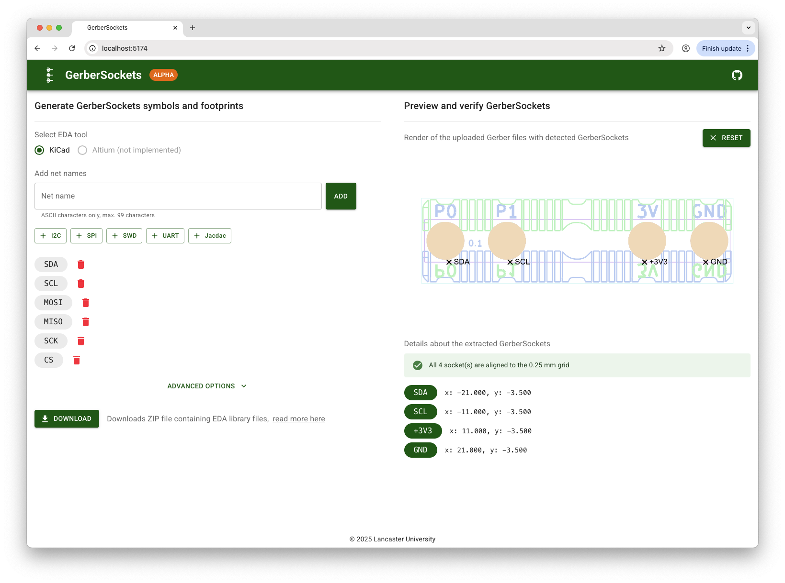

# GerberSockets generator and previewer

Easily generate ASCII GerberSockets for your electronics projects using this web tool. Currently, symbol and footprint generation is supported for KiCad. Future updates may include support for Altium.

## Why use this tool?

Previously, GerberSockets required you to manually map each net to a specific circle diameter, which was tedious and error-prone. This tool simplifies the process by encoding net names directly in ASCII using multiple circles for each socket—no manual mapping needed.

Learn more about the encoding method in the [How ASCII GerberSockets Work](#how-ascii-gerbersockets-work) section.

## Features

- ASCII-only net name validation (length: 1–99)
- Add/remove individual net names
- Quick-add popular signal groups:
  - I2C: `SDA`, `SCL`
  - SPI: `MOSI`, `MISO`, `SCK`, `CS`
  - UART: `TX`, `RX`
  - Jacdac: `JD_PWR`, `JD_DATA`, `GND`
- Advanced options:
  - Crosshair layer: F.Fab or User.Drawing
  - Sockets layer: User.1 or GerberSockets
  - Copper pad diameter: numeric (mm)
- One-click download of a ZIP containing:
  - GerberSockets/GerberSockets.pretty/.kicad_mod
  - GerberSockets/GerberSockets.kicad_sym

## How ASCII GerberSockets work

ASCII GerberSockets represent each net name using a series of circles, where each circle’s diameter encodes both its position and the ASCII value of the character:

### Identifier circle

The first circle (index 0) always has a diameter of `0.00999` to mark the start of a sequence.

### Character circles

For each character at position _i_ (1–99) with ASCII code _c_ (0–127), the diameter is formatted as `0.iiccc`, where `ii` is the two-digit index and `ccc` is the three-digit ASCII code.

### Example

The net name `GND` is encoded as: - 0: `0.00999` (identifier) - 1: `0.01071` (`G`) - 2: `0.02078` (`N`) - 3: `0.03068` (`D`)

This method is deterministic, self-describing, and easy to generate or parse. It avoids reliance on text rendering and ensures the geometry itself contains all necessary information.

## Development

This project uses React, TypeScript, Vite, and Material UI. To set up the project locally, open the project, `cd` into it, install dependancies with `npm install`, and start development server with `npm run dev`.

## Credits

Special thanks to everyone at the Lancaster University [Devices Lab](https://www.devices-lab.org/).
